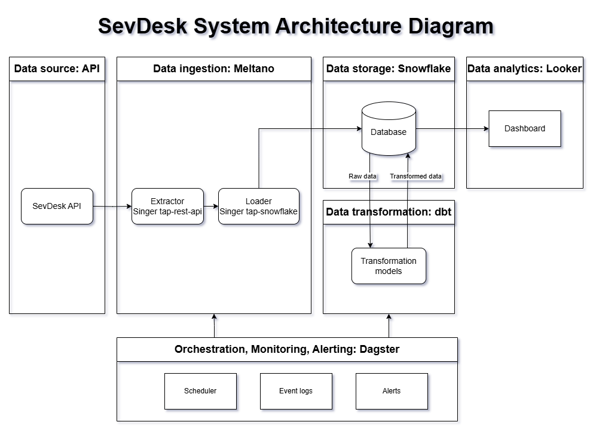
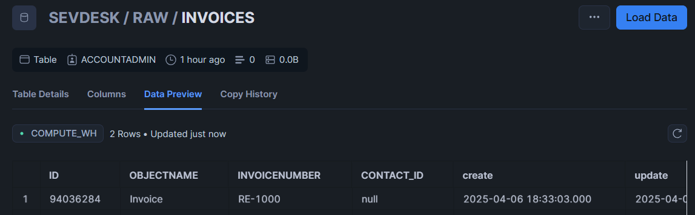
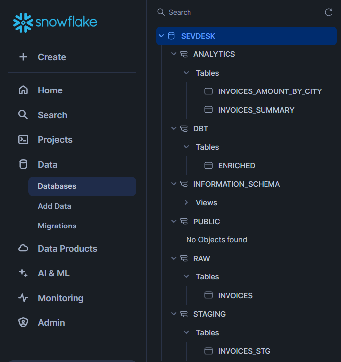

# Exercise: Build a Data Platform Design 

## System Architecture Diagram 



## Tech Stack
| Component | Tool | Purpose | Why? |
|-|-|-|-|
| Orchestration | Dagster | Schedule, execute, and monitor pipelines (Meltano + dbt workflows)|Modern orchestrator with lineage, status, retriy policies |
| Ingestion | Meltano SDK | Uses Singer taps (APIextractor + Snowflake loader) |Plugin-based extract/load, flexible to create custom plugins|
| Data Warehouse | Snowflake | Central storage of raw + transformed data |Cloud-native DWH with scalability, security, and dbt compatibility|
| Transformation | dbt | SQL-based modeling and transformations | Integrates with Snowflake, git-friendly, future-ready for Looker|
| Analytics | Looker | BI dashboard and exploration layer | Connects directly to Snowflake, supports dbt layer|
| Monitoring & Alerting| Dagster | Observability and alerting | UI for visual monitoring of logs, built-in alerting system (Slack/Email)|

## Data Piepline Steps for SevDesk invoices

### 1. Data extraction
- Job: set and scheduled on Dagster
- Frequency: the meltano pipeline is run on a fixed schedule (e.g., every hour) 
- Extractor: `tap-rest-api-msdk` in Meltano.
- Configuration: 
    - API URL: https://my.sevdesk.de/api/v1/
    - Headers: `Authorization header ({{ env('SEVDESK_API_KEY') }})`, dynamically set from environment variables stored in `.env`
    - Streams: The pipeline is designed to extract objects from `/Invoice` endpoint
```
meltano.yml
...
  extractors:
  - name: tap-rest-api-msdk
    variant: widen
    pip_url: tap-rest-api-msdk
    config:
      api_url: "https://my.sevdesk.de/api/v1"
      headers:
        Authorization: "{{ env('SEVDESK_API_KEY') }}"
        
      streams:
      - name: "invoice"
        path: "/Invoice"
        method: "GET"
        records_path: "objects"
...
```
### 2. Data loading
- Loader: `tap-snowflake` in Meltano
- Configuration:
```
meltano.yml
...
  loaders:
  - name: target-snowflake
    variant: meltanolabs
    pip_url: meltanolabs-target-snowflake
    config:
      user: "{{ env_var('SNOWFLAKE_USER') }}"
      password: "{{ env_var('SNOWFLAKE_PASSWORD') }}"
      account: "{{ env_var('SNOWFLAKE_ACCOUNT') }}"
      warehouse: "{{ env_var('SNOWFLAKE_WAREHOUSE') }}"
      database: "{{ env_var('SNOWFLAKE_DATABASE') }}"
      schema: "{{ env_var('SNOWFLAKE_SCHEMA') }}"
      role: "{{ env_var('SNOWFLAKE_ROLE') }}"
...
```    
- Output: load data into `SEVDESK.raw.invoices` table in Snowflake


### 3. Data Transformation
- Trigger: Dagster triggers the dbt transformation jobs to run directly on Snowflake
- Transformation: dbt models will clean and reshape this raw data to meet business requirements. The transformations can include aggregations, filtering, or creating new dimensions
- Output: cleaned data into `SEVDESK.staging.invoices_stg`, curated data into `analytics.invoices_summary` for e.g (business-ready models)

### 4. Data amalytics
- Looker Integration: Looker can directly query `analytics.invoices_summary` in Snowflake for business intelligence and analytics reporting
- Ouput: insight extraction from the data into dashboard

### 5. Monitoring and alerting
- Visualization: job executions can be accessed real time on Dagster UI 
- Configuration: send Slack/email notification to stakeholders whenever a pipeline fails, or retries are needed

## Use Case: Invoice Revenue Ranking by Country
The Finance or Sales team wants a dashboard that shows:
- The total invoice amount per city in €
- Updated every hour

1. Invoice data is ingested using maltano extractor triggered every hour by dagster

2. Data is loaded into snowflage raw schema

3. dbt staging models clean fields, cast types, convert ammount to the same currency, create a new table `analytics.invoices_amount_by_city`

4. Looker query the table in snowflake to generate a dashboard 
5. Dagter sends a notification in case one of the pipeline failed so that the finance team knows the dashboard is outdated


## Possible Enhancements

### Incremental Loading
- Problem:  
Loading all data every time from the SevDesk API can be inefficient, especially as the data grows over time
- Solution:   
Implement incremental loading using `update` timestamps in the SevDesk API. Only new or updated records are loaded, reducing the amount of data transferred and stored.
- Implementation:  
Modify the extractor (tap-rest-api-msdk) to fetch data based on `update` fields

### Event-Driven Ingestion via Webhooks
- Problem:  
Relying on a fixed schedule for data extraction can result in delays
- Solution: 
 Integrate webhooks to trigger data extraction whenever there is new data in SevDesk (e.g., a new invoice or payment)
- Implementation: 
 Implement a webhook listener to trigger the Meltano extraction pipeline upon receipt of an event from SevDesk. This can be done by using an HTTP API in Dagster

### CI/CD for Pipeline + dbt Deployment
- Problem:  
Maintaining pipeline and transformation code manually can be error-prone
- Solution:  
Use a CI/CD pipeline to automatically deploy and test changes to both the Meltano pipeline and dbt transformations
- Implementation:  
Set up a CI/CD pipeline with GitHub Actions to run tests and deploy updates automatically when code is pushed to the repository